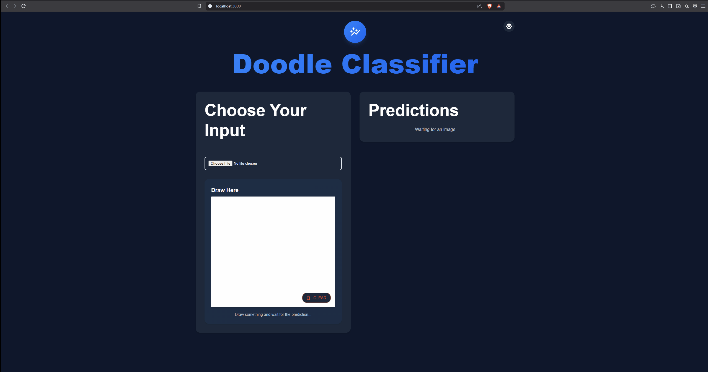

# 🖼️ Doodle Classifier

A web application that classifies doodles and uploaded images using a deep learning model. Users can draw on a canvas or upload an image, and the app will predict the doodle’s category with confidence scores. The backend uses a ResNet-50 model trained on a combined dataset of CIFAR-10, CIFAR-100, MNIST, and FashionMNIST, supporting 130 classes.

## ✨ Features
- **Draw and Predict**: Draw a doodle on a canvas, and the app will predict its category after a 500ms delay.
- **Upload and Predict**: Upload an image file to get predictions.
- **Responsive Design**: Mobile-friendly layout with a clean, modern UI.
- **Dark/Light Mode**: Toggle between dark and light themes.
- **Animated UI**: Smooth animations for a better user experience using Framer Motion.
- **Confidence Scores**: Displays the top prediction and other possible categories with confidence bars.
- **Deep Learning Model**: Uses a ResNet-50 model trained on 130 classes from CIFAR-10, CIFAR-100, MNIST, and FashionMNIST datasets.

> [!NOTE]  
> The model hasn't been trained effectively due to shortage of powerfull GPUs. However you can train it on your own, if you have CUDA-enabled GPU (NVIDIA).

## 📂 Project Structure
```
image_predictor/
├── backend/                # Flask backend
│   ├── app.py             # Flask server
│   ├── model_training.py  # Script to train the model
│   ├── model.py           # Model architecture and prediction logic
│   └── requirements.txt   # Backend dependencies
├── frontend/               # React frontend
│   ├── src/
│   │   ├── App.js         # Main React component
│   │   ├── DrawingBoard.js # Drawing canvas component
│   │   ├── UploadImage.js # Image upload component
│   │   ├── App.css        # Styling
│   │   └── index.js       # Entry point
│   ├── package.json       # Frontend dependencies
│   └── public/            # Static assets (e.g., index.html)
└── README.md              # Project info
```

## 🛠️ Setup Instructions

### Prerequisites
- **Node.js** and **npm** (for the frontend)
- **Python 3** and **pip** (for the backend)
- **CUDA-enabled GPU** (optional, for faster training and inference; CPU will be used if GPU is unavailable)

### Backend Setup
1. Navigate to the backend directory:
   ```
   cd backend
   ```
2. Install dependencies:
   ```
   pip3 install -r requirements.txt
   ```
3. (Optional) Train the model if you don’t have `trained_model.pth`:
   - Run the training script:
     ```
     python3 model_training.py
     ```
   - This will download the CIFAR-10, CIFAR-100, MNIST, and FashionMNIST datasets, train the ResNet-50 model for 50 epochs, and save the trained model as `trained_model.pth`.
   - **Note**: Training requires significant computational resources (GPU recommended) and may take several hours. The pretrained model (`trained_model.pth`) should already be included in the repository.
4. Start the Flask server:
   ```
   python3 app.py
   ```
   The backend will run on `http://localhost:5000`.

### Frontend Setup
1. Navigate to the frontend directory:
   ```
   cd frontend
   ```
2. Install dependencies:
   ```
   npm install
   ```
3. Start the React development server:
   ```
   npm start
   ```
   The frontend will run on `http://localhost:3000`.

### Running the Application
- Ensure both the backend and frontend are running simultaneously.
- Open `http://localhost:3000` in your browser to use the app.
- Draw a doodle or upload an image to see predictions.

## 🧠 Model Training
The backend uses a ResNet-50 model trained on a combined dataset of:
- **CIFAR-10**: 10 classes (e.g., airplane, cat, dog).
- **CIFAR-100**: 100 classes (e.g., apple, bear, bicycle).
- **MNIST**: 10 digit classes (labeled as `digit_0` to `digit_9`).
- **FashionMNIST**: 10 clothing classes (e.g., t-shirt, sandal).

### Training Details
- **Total Classes**: 130.
- **Epochs**: 50 (configurable in `model_training.py`).
- **Batch Size**: 128.
- **Optimizer**: Adam with a learning rate of 0.001.
- **Loss Function**: CrossEntropyLoss.
- **Transformations**: Resize to 32x32, normalize to [-1, 1], convert grayscale images to 3 channels.

To retrain the model, run:
```
cd backend
python3 model_training.py
```

## 📡 Backend API
The backend exposes a single endpoint for predictions:

- **Endpoint**: `POST /predict`
- **Request**: Form-data with an `image` field containing the image file (PNG/JPEG).
- **Response**:
  ```json
  {
    "top_prediction": { "label": "cat", "probability": "99.9%" },
    "others": [
      { "label": "dog", "probability": "0.1%" },
      { "label": "tiger", "probability": "0.05%" },
      ...
    ]
  }
  ```
- **Error Response**:
  ```json
  { "error": "Error message" }
  ```

## 📦 Dependencies

### Frontend Dependencies
- `react` and `react-dom`: Core React libraries.
- `@mui/material`, `@mui/styles`, `@mui/icons-material`: Material-UI components for the UI.
- `framer-motion`: For animations.
- `react-sketch-canvas`: For the drawing canvas.

Install them using:
```
cd frontend
npm install
```

### Backend Dependencies
- `flask`: Web framework for the server.
- `torch`: PyTorch for deep learning.
- `pillow`: Image processing.
- `numpy`: Numerical operations.
- `torchvision`: Datasets and models.
- `flask_cors`: Enable CORS for frontend communication.
- `tqdm`: Progress bars for training (optional).

Install them using:
```
cd backend
pip3 install -r requirements.txt
```

## 🎨 Demo


## 🚀 Future Improvements
- Add more drawing tools (e.g., color picker, brush size).
- Support for touch devices for drawing.
- Improve prediction accuracy with a larger dataset or fine-tuning.
- Add loading states for individual components.
- Deploy the app to a cloud platform (e.g., Heroku, AWS).
- Add API documentation using Swagger/OpenAPI.

## 📜 License
MIT License.

## 🙌 Contributing
Contributions are welcome! Please open an issue or submit a pull request with your improvements.
